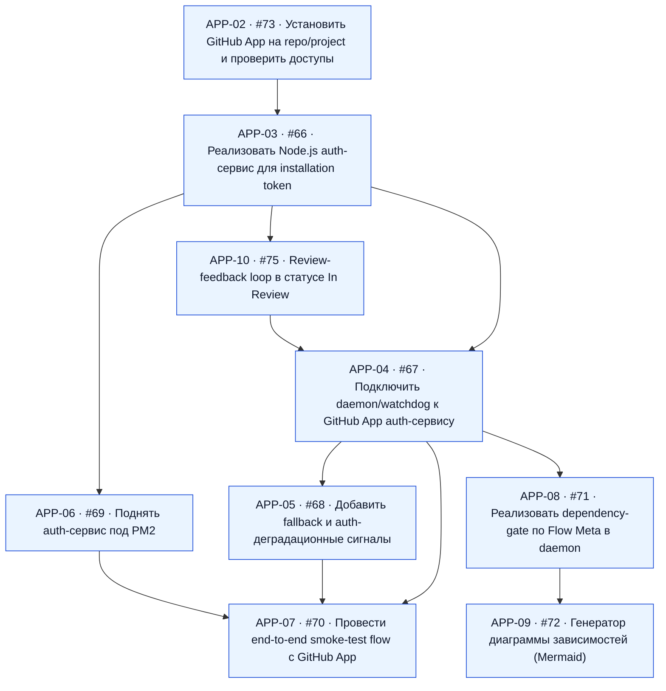

# Диаграмма зависимостей APP-issues

Сгенерировано: `2026-02-24T02:04:18Z`.

Источник данных:
- Репозиторий: `justewg/planka`
- Выборка: `gh issue list --state all --limit 200`
- Найдено APP-issues: `9`

## Ошибки парсинга
- Issue #73: Depends-On содержит нераспознанный токен "APP-01 (Draft)"
