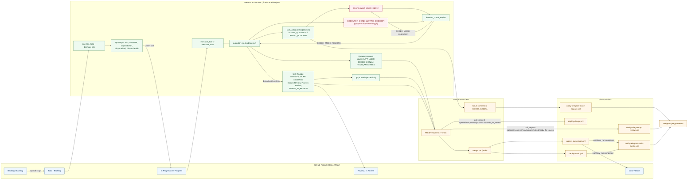
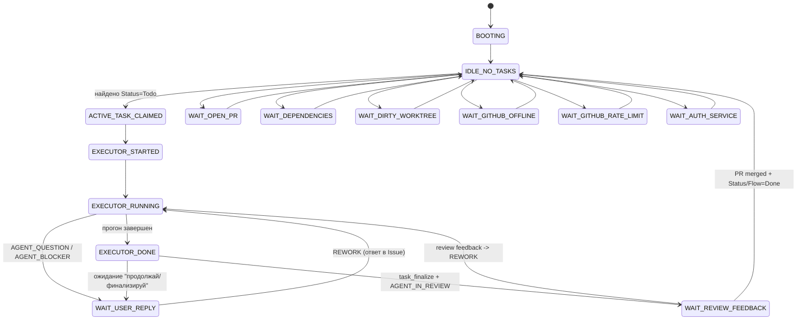
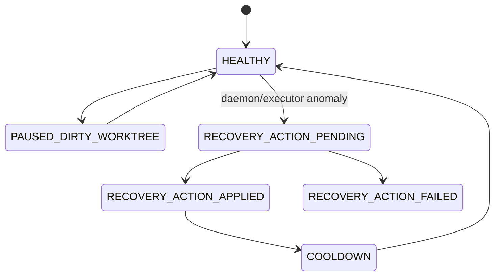

# ISSUE-330 · Диаграмма полного флоу PLANKA

Ниже зафиксирован единый end-to-end flow: `GitHub Project -> daemon -> executor -> Issue/PR -> GitHub Actions -> состояния`.

```mermaid
flowchart LR
  classDef state fill:#eef7ff,stroke:#1d4e89,color:#0b2f57,stroke-width:1px;
  classDef proc fill:#eefaf0,stroke:#1f6f3f,color:#134225,stroke-width:1px;
  classDef gh fill:#fff6e8,stroke:#9a6700,color:#5f3b00,stroke-width:1px;
  classDef wait fill:#fff1f2,stroke:#9f1239,color:#7f1d1d,stroke-width:1px;

  subgraph Project["GitHub Project (Status / Flow)"]
    PB["Backlog / Backlog"]:::state
    PT["Todo / Backlog"]:::state
    PI["In Progress / In Progress"]:::state
    PRV["Review / In Review"]:::state
    PD["Done / Done"]:::state
  end

  subgraph Daemon["Daemon + Executor (.flow/shared/scripts)"]
    DL["daemon_loop + daemon_tick"]:::proc
    DCHK["Проверки: lock, open PR, Depends-On,<br/>dirty tracked, GitHub health"]:::proc
    DST["executor_tick -> executor_start"]:::proc
    EX["executor_run (codex exec)"]:::proc
    TEMP["Промежуточные коммиты/PR update<br/>CODEX_SIGNAL: TEMP_PROGRESS"]:::proc
    ASK["task_ask(question|blocker)<br/>AGENT_QUESTION / AGENT_BLOCKER"]:::proc
    WAITU["STATE=WAIT_USER_REPLY"]:::wait
    REPLY["daemon_check_replies"]:::proc
    DONEW["EXECUTOR_DONE_WAITING_DECISION<br/>(продолжай/финализируй)"]:::wait
    FINAL["task_finalize:<br/>commit+push, PR create/edit,<br/>Status=Review, Flow=In Review,<br/>AGENT_IN_REVIEW"]:::proc
    READY["gh pr ready (если draft)"]:::proc
  end

  subgraph GH["GitHub Issue / PR"]
    IC["Issue comment c CODEX_SIGNAL"]:::gh
    PR["PR development -> main"]:::gh
    MRG["Merge PR (main)"]:::gh
  end

  subgraph GHA["GitHub Actions"]
    WFI["notify-telegram-issue-signals.yml"]:::gh
    WFR["notify-telegram-pr-review.yml"]:::gh
    WFP["deploy-dev-pr.yml"]:::gh
    WFA["project-auto-close.yml"]:::gh
    WFM["deploy-main.yml"]:::gh
    WFN["notify-telegram-main-merge.yml"]:::gh
  end

  TG["Telegram уведомления"]:::gh

  PB -->|ручной старт| PT
  PT --> DL
  DL --> DCHK
  DCHK -->|claim task| PI
  PI --> DST
  DST --> EX
  EX --> TEMP
  EX --> ASK
  ASK --> WAITU
  WAITU --> REPLY
  REPLY -->|CODEX_MODE: QUESTION| WAITU
  REPLY -->|CODEX_MODE: REWORK| EX
  EX --> DONEW
  DONEW --> REPLY
  EX -->|финальная дельта| FINAL
  FINAL --> PRV
  FINAL --> READY
  TEMP --> PR
  READY --> PR
  FINAL --> PR

  ASK --> IC
  IC --> WFI
  WFI --> TG

  PR -->|pull_request opened/reopened/synchronize/edited/ready_for_review| WFR
  PR -->|pull_request opened/reopened/synchronize/ready_for_review| WFP
  WFR --> TG

  PR --> MRG
  MRG --> WFA
  MRG --> WFM
  WFA --> PD
  WFA -->|workflow_run completed| WFN
  WFM -->|workflow_run completed| WFN
  WFN --> TG
```

```mermaid
stateDiagram-v2
  [*] --> BOOTING
  BOOTING --> IDLE_NO_TASKS

  IDLE_NO_TASKS --> ACTIVE_TASK_CLAIMED: найдено Status=Todo
  ACTIVE_TASK_CLAIMED --> EXECUTOR_STARTED
  EXECUTOR_STARTED --> EXECUTOR_RUNNING

  EXECUTOR_RUNNING --> WAIT_USER_REPLY: AGENT_QUESTION / AGENT_BLOCKER
  WAIT_USER_REPLY --> EXECUTOR_RUNNING: REWORK (ответ в Issue)

  EXECUTOR_RUNNING --> EXECUTOR_DONE: прогон завершен
  EXECUTOR_DONE --> WAIT_USER_REPLY: ожидание "продолжай/финализируй"
  EXECUTOR_DONE --> WAIT_REVIEW_FEEDBACK: task_finalize + AGENT_IN_REVIEW
  WAIT_REVIEW_FEEDBACK --> EXECUTOR_RUNNING: review feedback -> REWORK
  WAIT_REVIEW_FEEDBACK --> IDLE_NO_TASKS: PR merged + Status/Flow=Done

  IDLE_NO_TASKS --> WAIT_OPEN_PR
  IDLE_NO_TASKS --> WAIT_DEPENDENCIES
  IDLE_NO_TASKS --> WAIT_DIRTY_WORKTREE
  IDLE_NO_TASKS --> WAIT_GITHUB_OFFLINE
  IDLE_NO_TASKS --> WAIT_GITHUB_RATE_LIMIT
  IDLE_NO_TASKS --> WAIT_AUTH_SERVICE

  WAIT_OPEN_PR --> IDLE_NO_TASKS
  WAIT_DEPENDENCIES --> IDLE_NO_TASKS
  WAIT_DIRTY_WORKTREE --> IDLE_NO_TASKS
  WAIT_GITHUB_OFFLINE --> IDLE_NO_TASKS
  WAIT_GITHUB_RATE_LIMIT --> IDLE_NO_TASKS
  WAIT_AUTH_SERVICE --> IDLE_NO_TASKS
```

```mermaid
stateDiagram-v2
  [*] --> HEALTHY
  HEALTHY --> PAUSED_DIRTY_WORKTREE
  HEALTHY --> RECOVERY_ACTION_PENDING: daemon/executor anomaly
  RECOVERY_ACTION_PENDING --> RECOVERY_ACTION_APPLIED
  RECOVERY_ACTION_PENDING --> RECOVERY_ACTION_FAILED
  RECOVERY_ACTION_APPLIED --> COOLDOWN
  COOLDOWN --> HEALTHY
  PAUSED_DIRTY_WORKTREE --> HEALTHY
```
